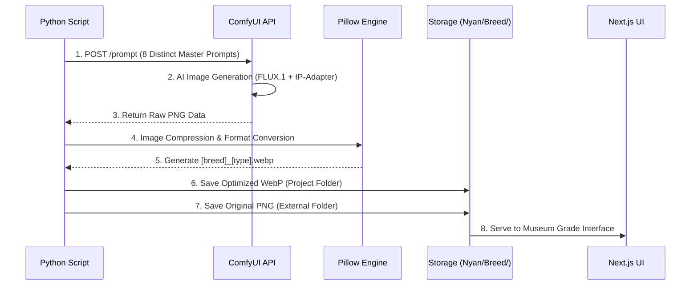

# 🧠 CORE_LOGIC (AI Generation Pipeline Deep-Dive)

## 1. 설계 의도 (Design Intent)
박물관급 고양이 도감을 위해 **피사체의 생물학적 정확성(Biological Accuracy)**과 **미학적 일관성(Aesthetic Consistency)**을 동시에 달성하는 것을 목표로 합니다. 이를 위해 단순 T2I(Text-to-Image)가 아닌 IP-Adapter와 고정된 박물관용 프롬프트 시스템을 결합하였습니다.

## 2. 핵심 알고리즘 (Core Algorithms)

### A. 8종 마스터 패키지 파이프라인 (generate_masterpiece.py)
단순 전신 샷을 넘어, 품종의 해부학적 특징을 다각도에서 포착하는 8종의 에셋을 생성합니다.
- **8종 구성**: `Hero`, `Full Body Front`, `Full Body Side`, `Strict Profile`, `Eye Macro`, `Coat Texture`, `Variant`, `Portrait`.
- **작동 원리**:
  1. 각 컴포지션마다 특화된 **박물관용 프롬프트** 적용.
  2. `IP-Adapter`를 통해 참조 이미지의 품종 특징(모색, 골격) 유지.
  3. **WebP 자동 변환**: `Pillow`를 사용하여 생성된 PNG를 웹 최적화용 WebP(품질 85)로 자동 압축 저장.

### B. UI/UX 데이터 통합 엔진 (ClientPage.tsx)
박물관 도판 스타일의 레이아웃과 방대한 스펙 데이터를 유기적으로 결합합니다.
- **Morphology Grid**: `aspect-ratio` 기반의 비대칭 그리드를 통해 사진 잘림 방지 및 시각적 리듬감 부여.
- **Health & Stats**: 유전병(Health Risks), 수명, 체중 데이터를 시각적 패널로 자동 바인딩.

## 🖼️ Data-Driven Asset Generation (Museum Standard)

### 1. 에셋 패키지 표준 (The 8-Asset Package)
모든 품종은 박물관 도판급 퀄리티를 위해 다음 8가지 구도의 에셋을 반드시 포함한다:
- `hero`: 대리석/콘크리트 기단 위의 우아한 전신 (메인)
- `full_body_front / side`: 정면 및 측면 실루엣 (해부학적 무결성)
- `strict_profile`: 90도 측면 두상 (품종 표준 확인용)
- `face_portrait`: 풍부한 표정과 눈동자가 강조된 초근접 샷
- `eye_macro / coat_texture`: 홍채 패턴 및 모질 질감 (극사실주의)
- `variant_full_body`: 다른 색상/무늬 변종 (종의 다양성)

### 2. 동적 프롬프트 주입 (Dynamic Injection)
프롬프트를 하드코딩하지 않고, `breeds/*.json`의 데이터를 실시간으로 읽어와 주입한다:
- `{appearance_en}`: 해부학적 특징 주입 (Anatomical Accuracy)
- `{breed_name}`: 품종 정체성 부여
- **IP-Adapter (Subtle Guide)**: 참조 이미지가 있을 경우 `weight 0.25`로 설정하여 텍스트 데이터의 지배력을 유지하면서 구도만 참조함.

## 3. 데이터 흐름 (Data Flow Detail)

### 🔄 이미지 생성 시퀀스 (Sequence Diagram)

### 🔄 마스터피스 생성 및 웹 최적화 시퀀스

## 4. 프롬프트 엔지니어링 전략

### 🏛️ Museum Masterpiece Prompt
- **Subject**: `{breed} cat` + `feline cat` (강제 식별자)
- **Environment**: `grey concrete pedestal`, `PITCH-BLACK background`
- **Camera**: `Sony A7R V, 85mm, f/16` (Deep Focus 확보)
- **Negative**: `human, flower, dog, bokeh, blurry` (품종 왜곡 방지)

## 5. 예외 처리 전략 (Havana Clause)
- **Hallucination Prevention**: `feline cat` 키워드를 프롬프트 최전방에 배치하여 Havana Brown이 '쿠바 시가'로 생성되는 등의 오류 원천 차단.
- **Retry Logic**: ComfyUI 연결 실패 시 타임아웃 처리 및 생성 로그(`generation.log`) 기록.

## 6. 의존성 관계 (Dependencies)
- **ComfyUI**: 로컬 서버 가동 필수 (8188 포트).
- **FLUX.1-dev-fp8**: 주력 체크포인트.
- **IP-Adapter SDXL**: 참조 이미지 임베딩용.
- **Next.js 15**: 생성된 정적 에셋을 사용자에게 서빙.
