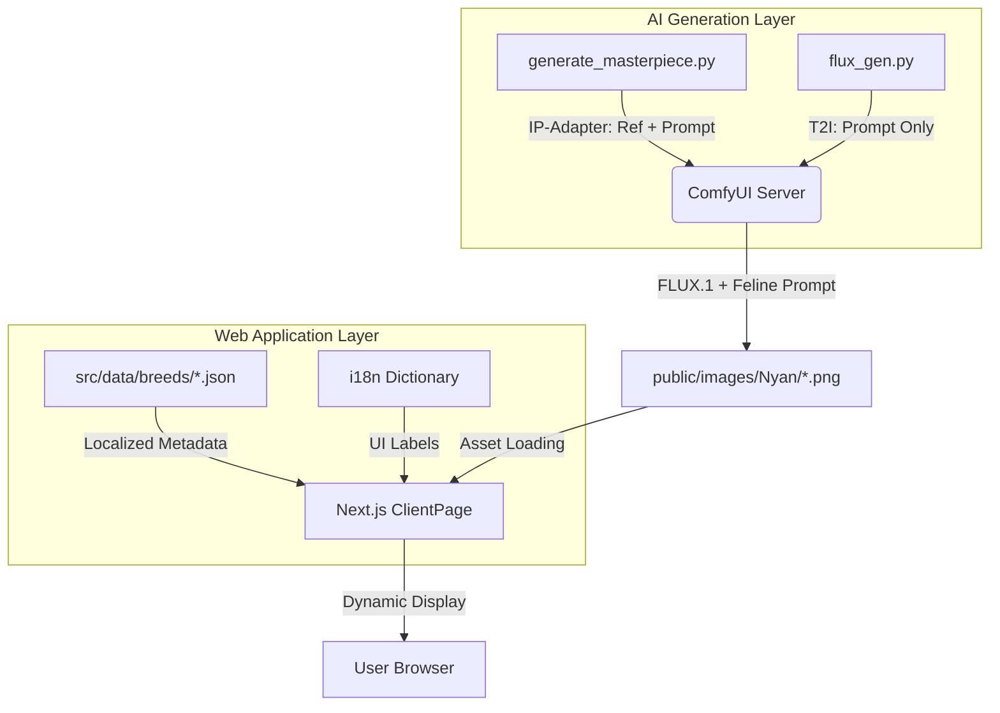

# 🗺️ SYSTEM_MAP (nyan - Museum-Grade Cat Encyclopedia)

## 1. 프로젝트 개요 (Overview)
- **목표**: 50종의 고양이 품종에 대한 박물관급 초실사 도감 서비스 제공.
- **핵심 가치**: 박물관급 미학(Aesthetic), 고밀도 전문 데이터, 최첨단 AI(FLUX) 에셋.

## 2. 기술 스택 (Tech Stack)
- **Frontend**: Next.js 15 (App Router), TypeScript, Vanilla CSS.
- **State/Data**: Static JSON-based Data Layer + **i18n Translation Dictionary**.
- **AI Pipeline**: ComfyUI (Local API), FLUX.1 [dev], Python Automation.
  - **Generation Engines**: 
    - `generate_masterpiece.py`: **IP-Adapter** 기반 (참조 이미지의 특징 유지 + 박물관 미학).
    - `flux_gen.py`: **Pure T2I** 기반 (프롬프트 100% 반영, 유실 에셋 복구용).
- **Environment**: Local Windows (RTX 5080), PowerShell/CMD.

## 3. 디렉토리 구조 (Directory Structure)

### 📂 `src/` (Core Application)
- `app/[lang]/breeds/[slug]/`: 품종 상세 페이지 (다국어 지원).
  - `page.tsx`: 서버 사이드 데이터 패칭.
  - `ClientPage.tsx`: **[i18n 대응]** 언어별 UI 라벨 처리 및 고해상도 이미지 렌더링.
- `lib/`: 유틸리티 로직.
  - `breeds.ts`: JSON 데이터 로드 및 타입 정의 (`BreedData`).
- `data/breeds/`: **[중요]** 50종의 품종별 마스터 JSON 데이터 저장소 (한/영 병기).
- `data/target_refs/`: IP-Adapter용 고해상도 품종 참조 이미지 저장소.

### 📂 `public/` (Static Assets)
- `images/Nyan/`: 실시간 생성된 초고화질 고양이 이미지 에셋 (.png).
- `images/Nyan_backup/`: 사용자 복구 데이터 및 기존 생성본 보관소.

### 📂 `.gravityBrain/` (Memory & Map)
- `MEMORY.md`: 프로젝트 진행 상황 및 단기 기록.
- `SYSTEM_MAP.md`: 현재 이 문서 (시스템 전체 구조도).
- `CONCEPT_LOGIC.md`: 피사체 무결성 및 생성 원칙### 📁 Data & Content (Museum Grade)
- `src/data/breeds/*.json`: 52종 전 품종의 상세 데이터 (Standardized with Care Index, Social, Economics)
- `public/images/Nyan/{breed_id}/`: 품종별 8종 마스터피스 에셋 (WebP)

### ⚙️ Automation Pipelines
- `generate_masterpiece.py`: 통합 생성 메인 엔진
- `generate_manx.py`: 맨크스 전용 정밀 생성 스크립트
- `generate_rest_of_catalog.py`: 30위 밖 품종 전용 재생성 파이프라인 (Overwrite 모드)
- `upgrade_museum_data.py`: 전 품종 데이터 표준화 및 업그레이드 툴
우선 생성' 및 'T2I 복구' 로직이 적용된 보강 엔진.
- `workflow_api.json`: FLUX.1 이미지 생성을 위한 고정 워크플로우 설정 (ComfyUI API).
- `middleware.ts`: 다국어 라우팅 및 정적 에셋 경로 예외 처리.

## 4. 데이터 흐름도 (Data Flow)

## 5. 핵심 모듈 간 관계 (Module Relationships)
1. **IP-Adapter ↔ Reference Data**: `generate_masterpiece.py`가 `target_refs/` 폴더의 이미지를 ComfyUI에 업로드하여 품종의 고유 형상을 고정.
2. **JSON Data ↔ Asset Pipeline**: 생성 엔진들이 JSON의 고도화된 프롬프트를 읽어 이미지를 생성하되, `public/images/Nyan/`의 존재 여부에 따라 'Missing-First' 전략 수행.
3. **Next.js ↔ i18n Dictionary**: `ClientPage.tsx` 내부의 번역 객체가 `lang` 파라미터에 따라 `ECONOMICS`, `SOCIAL` 등의 영문 라벨을 실시간 한글화.
4. **ComfyUI ↔ Workflow**: 피사체 왜곡 방지를 위해 `feline cat` 키워드와 강력한 부정 프롬프트가 적용된 워크플로우 수행.
